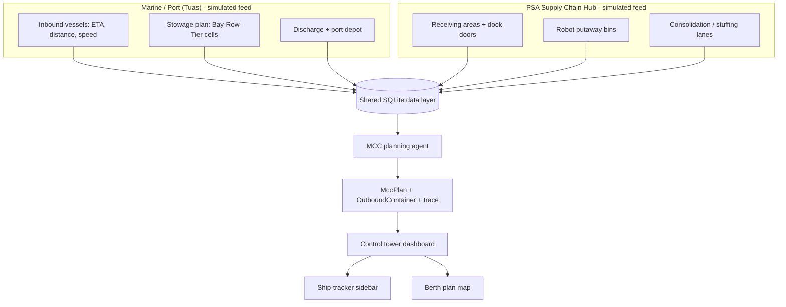

# PSA iWX — MCC Control Tower (Port–PSCH Agentic Coordination)

## 1. Overview

This project prototypes a shared, agent-driven coordination layer between two
adjacent facilities in PSA's Tuas Port ecosystem: the **Container Port**
(vessel, quay, yard, and gate operations) and the **PSA Supply Chain Hub
(PSCH)** — the container freight station and distribution centre scheduled to
open in 2027, absorbing the consolidation and deconsolidation functions
currently run at Keppel Distripark.

The focus is **multi-country consolidation (MCC) cargo**: cargo that arrives at
Tuas inside inbound containers, must be deconsolidated at PSCH, stored, and
then re-consolidated into outbound containers that must make a specific
vessel's loading plan. An LLM-style **planning agent** — here a deterministic
rule-based brain, so demos are fully reproducible with zero API cost — owns the
cross-facility coordination decisions and records every step in an auditable
execution trace.

All data is synthetic, modelled on realistic port and container-freight-station
structures rather than actual CITOS/PORTNET schemas.

## 2. Background

* PSA's Node to Network (N2N) strategy is explicitly about connecting previously
  siloed operational nodes into an integrated, digitally visible network.
* PSCH is sited directly adjacent to Tuas Port within the same Free Trade Zone
  and is designed for seamless integration with the wider supply chain — but the
  two facilities run fundamentally different kinds of operations. The Port
  handles sealed containers at high volume with mature, decades-old optimization
  systems (CITOS). PSCH handles opened, matched, and consolidated cargo — a
  messier, more judgment-heavy problem space that's a better fit for agentic
  reasoning than for classical scheduling algorithms.
* The highest-leverage integration point between the two is the physical and
  informational **handoff of MCC cargo**: containers discharged at the port that
  need deconsolidation at PSCH, and consolidated export containers from PSCH
  that need to make a vessel's loading plan.

## 3. Problem Statement

Today, in this simulation, an MCC container's journey is a black box: the cargo
owner sees it on the vessel, and then nothing until it surfaces at PSCH — if it
surfaces at all. PSCH's receiving area and bin storage are planned reactively
when trucks arrive, and outbound consolidated containers aren't reliably synced
to vessel cutoffs. This creates avoidable dwell time, storage surprises, and
missed sailings.

**What this prototype builds:** a control tower that shows the full MCC cargo
journey end-to-end (vessel tracker → quay → depot → road → PSCH doorstep →
robot putaway → consolidation → back to the vessel), driven by an agent that:

1. derives the **PSCH receipt ETA** from the carrying vessel's ETA,
2. plans the **receiving area** and **robot putaway bins** before the cargo
   arrives, based on inbound volume rate,
3. produces the **full PSCH process plan** for every stage — arrival, staging
   wait, move to bin, pallet pick time (driven by the outbound vessel's arrival
   for loading), and lane release per container number,
4. plans each **outbound consolidation container** against a specific vessel:
   which vessel, when it leaves the port, the exact loading cell on the vessel,
   and the ETA to arrive at the quay loading area.

## 4. System Architecture



## 5. Data Model & Requirements

### 5.1 Marine / port-side data (simulated)

* **Vessel**: voyage ID, name, status (docked / inbound), berth ID, ETA, ETD,
  moves planned, next destination, **distance from Tuas (nm)** and **speed
  (kn)** — the ship-tracker fields.
* **Container**: container ID, carrying voyage, size/type, cargo flag, customs
  status, special handling, and **stow position** — the exact cell in the
  vessel's stowage plan in industry **Bay-Row-Tier** notation
  (e.g. `Bay 34 · Row 08 · Tier 02`).

Example:

```json
{
  "container_id": "MSCU1234567",
  "voyage_id": "MAERSK-EG-24E",
  "cargo_flag": "deconsolidation_required",
  "size_type": "40HC",
  "stow_position": "Bay 34 · Row 08 · Tier 02"
}
```

### 5.2 PSCH-side data (simulated)

* **Booking**: service type (LCL deconsolidation / MCC consolidation), storage
  zone, destination, required-by.
* **Shipment (pallet)**: the palletised cargo units deconsolidated from each
  inbound container, with their destination and the source container they came
  from — the units that will later be re-consolidated.

### 5.3 Agent output — `MccPlan` (per inbound container)

Derived entirely from the carrying vessel's ETA:

```json
{
  "container_id": "MSCU1234567",
  "carrying_vessel_id": "MAERSK-EG-24E",
  "vessel_distance_nm": 0.0,
  "vessel_speed_knots": 0.0,
  "stow_position": "Bay 34 · Row 08 · Tier 02",
  "sea_arrival": "2026-08-15T14:00:00Z",
  "unload_end": "2026-08-15T17:00:00Z",
  "depot_arrive": "2026-08-15T17:45:00Z",
  "road_depart": "2026-08-15T19:30:00Z",
  "psch_receipt_eta": "2026-08-15T20:15:00Z",
  "receiving_area": "RA-1 · Door 3",
  "staging_start": "2026-08-15T20:15:00Z",
  "staging_end": "2026-08-15T20:35:00Z",
  "move_start": "2026-08-15T20:35:00Z",
  "move_end": "2026-08-15T20:50:00Z",
  "bin_location": "Bin 1-12-2A",   # DC convention: AISLE-LEVEL-BAY (Aisle 1, Level 12, Bay 2A)
  "putaway_robot": "Robot 03",
  "pallet_pick_time": "2026-08-15T23:00:00Z",
  "release_lane": "5–7",  # releasing lanes (plain numbers) where this group's pallets stage
  "consolidation_group": "OOLU9048871",
  "reasoning": "Carried by MAERSK EGYPT ..."
}
```

### 5.4 Agent output — `OutboundContainer` (per consolidation group)

```json
{
  "container_id": "OOLU9048871",
  "destination": "Singapore",
  "source_container_ids": ["MSCU1234567", "..."],
  "bound_vessel_id": "MAERSK-EG-24E",
  "vessel_etd": "2026-08-16T16:00:00Z",
  "stow_position": "Bay 08 · Row 04 · Tier 02",
  "stuffing_start": "2026-08-16T03:00:00Z",
  "stuffing_end": "2026-08-16T09:00:00Z",
  "lane_release_time": "2026-08-16T09:00:00Z",
  "loading_lane": "Lane 1",
  "staging_lane_start": 5,   # physical releasing lanes at PSCH: lanes 5..7
  "staging_lane_end": 7,
  "road_depart": "2026-08-16T09:45:00Z",
  "eta_loading_area": "2026-08-16T10:30:00Z",
  "status": "loaded"
}
```

The releasing lanes (numbered plainly 1..26) are drawn on PSCH Space as 26
narrow vertical blocks parked side by side above the facility, like dock doors
along a warehouse wall. The agent allocates each consolidation container one
lane, or a contiguous group of adjacent lanes, sized by the pallets staged for
that container; clicking a container shows the cargo planned to stage on its
lanes for collection.

### 5.5 Journey status model

Inbound (derived from the plan times vs. the sim clock):

```
En Route (Sea) → Unloaded → Depot → En Route (Road) → Arrived
```

Outbound: `staged → released → in_transit → loaded`.

## 6. Agentic AI Design

The MCC planning agent follows the propose-review-execute pattern in its
advisory form: it reads the shared data layer through a read-only **tool layer**
(every call is logged to the trace), derives the plan with explicit reasoning,
and writes only plans — nothing executes.

It handles **uncertainty and incomplete information** by degrading gracefully:
every decision is deterministic, every stage time is derived from a single
source (the vessel ETA), and customs-HELD / special-handling cargo is flagged in
the reasoning. The dashboard gives a human planner the complete picture to
override at any point, matching the risk profile of the decision.

## 7. Scope & Phasing

**This build (Phase 1–3 folded into one coherent slice):**

* Synthetic world generator (fleet with tracking, containers with stow cells,
  pallet shipments)
* MCC planning agent: journey timeline, receiving/putaway plan, consolidation
  schedule
* Control-tower dashboard: searchable incoming container combobox (list
  collapses to widen the ship-tracker detail on selection), berth plan map with
  vessel highlight, PSCH plan, KPIs, execution trace

**Later phases:** swap the deterministic brain for an LLM backend using the same
tool layer; move routine, low-stakes scheduling decisions toward autonomous
approval; stream live ETA updates instead of a fixed sim clock.

## 8. Suggested Tech Stack

| Layer | Choice | Why |
|---|---|---|
| Agent brain | Deterministic rule-based planner (LLM-swappable) | Zero-cost, reproducible demos |
| Backend / data sim | Python | Fits data-analytics-heavy workflows |
| Data layer | SQLite | No infra needed for a prototype |
| Dashboard | stdlib HTTP + Streamlit | Two frontends, one data layer |
| Models | Pydantic | Validated, self-documenting records |

```
psa-agentic-coordination/
├── PROJECT_SPEC.md
├── config.py
├── models/schemas.py
├── data/simulator.py, store.py, seed.py
├── agents/mcc_planner.py, run.py
├── analysis/kpis.py
├── server.py
└── dashboard/app.py
```

## 9. Success Criteria

* Agent produces an explainable, internally-consistent plan for every inbound
  MCC container (journey timeline, receiving area, bin, consolidation group)
  and every outbound container (bound vessel, loading cell, ETAs).
* Dashboard clearly shows the cargo story end-to-end — ship tracker, journey
  status, PSCH plan, and the vessel each outbound container is bound for.
* Code demonstrates data modeling, agent orchestration, and a working UI as one
  complete, coherent slice.

## 10. Assumptions & Open Questions

* No real PSA system access; all data structures are inferred from public
  information about port/CFS operations, not actual CITOS/PORTNET schemas.
* A production version would need real-time integration (AIS/ETA feeds,
  PORTNET/CITOS adapters), security/governance, and change-management processes
  not modelled here.
* This is a demonstration prototype, scoped for one person to build with AI
  coding assistance.
